<div align="center">

# AMS2 Coach

**Live telemetry and a driving coach for Automobilista 2, in your browser.**

Put it on your second monitor while you drive. It shows your live delta, where the last lap
lost time, and exactly what to try on the next one.

[](https://github.com/chris-r-uol/ams2-telemetry/actions/workflows/ci.yml)
[](LICENSE)


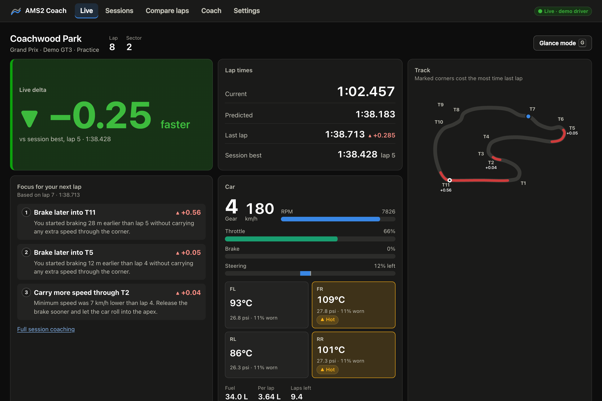

</div>

> Screenshots in this README come from the built-in **demo mode**: a simulated driver lapping a
> fictional circuit, streamed through the same packet decoder the real game uses.

## What it does

- **Live dashboard for a second monitor.** A huge live delta against your best lap, current,
  predicted, last and best lap times, sector, gear, speed, pedals, tyre temperatures and
  pressures, fuel per lap and laps remaining.
- **A coach after every lap.** The three corners that cost the most, each with a specific fix:
  *"Brake later into T11: you started braking 28 m earlier than lap 5 without carrying any
  extra speed."*
- **Lap-to-lap comparison.** Any two laps from any sessions on the same track: time difference,
  speed, throttle, brake, steering and gear by distance, with a map of where time was gained and
  lost and a corner-by-corner breakdown.
- **Session coaching.** Your ideal lap (your best run through every corner, combined), how far
  your best lap is from it, consistency, and **habits**: mistakes you repeat lap after lap.
- **Car setup analysis.** Understeer and oversteer through every corner, slip angle,
  lock-ups, wheelspin, suspension travel, ride height, bottoming, bump stops, wheels lifting,
  damper histograms and roll/dive figures, with suggestions for what to change and a
  side-by-side comparison with another setup. [How it's worked out](docs/car-setup.md).
- **Raw telemetry recording.** Press Record, drive, then download the file. It replays
  exactly on any computer, which makes it the best way to share a problem.
- **Every lap saved** automatically, with sectors, top speed, fuel and tyre data, and
  downloadable as JSON.
- **Live presets** for reading from the driving seat: arrange cards on a grid three wide and
  two high that fits one screen, and switch presets with <kbd>1</kbd>–<kbd>9</kbd>. Plus dark
  and light themes and text size up to 150%.
- **Built to be accessible.** Colour-blind-safe palette, and colour is never the only signal:
  deltas carry a sign, an arrow and the word *faster* or *slower*. Keyboard navigation, a table
  view for every chart, and optional screen-reader lap announcements.

## Quick start

On the Windows PC you race on:

1. Install **[Node.js LTS](https://nodejs.org)** (version 22.18 or newer).
2. Download this project: **Code → Download ZIP** and unzip it, or `git clone https://github.com/chris-r-uol/ams2-telemetry.git`.
3. Double-click **`start-windows.bat`**. The first run installs dependencies; after that it opens the dashboard at <http://localhost:8606>.
4. In Automobilista 2 go to **Options → System** and set:
   - **UDP Frequency**: `1`
   - **UDP Protocol Version**: `Project CARS 2`
5. Drag the dashboard to your second monitor and head out on track.

Prefer a terminal? `npm install` then `npm start`.

### Try it without the game

```bash
npm install
npm run demo
```

A simulated driver laps *Coachwood Park* with some very human habits (early braking, a lazy
throttle, a trip over the grass), so every feature has something to show. This is how the
project is developed on a Mac.

## Tour

### Compare any two laps

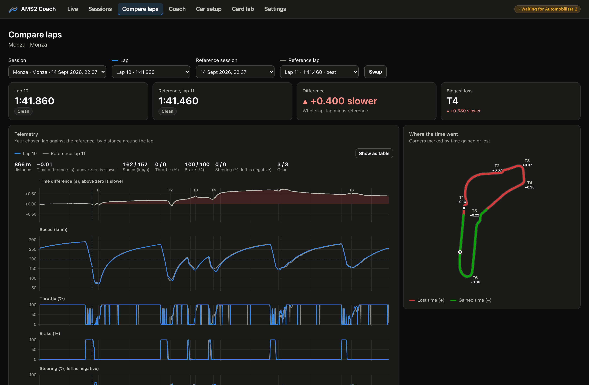

Pick any lap and any reference from the same track. Point at the charts to read every channel
at once, and the map marks the same spot. Drag to zoom; every chart also has a table view.

### Coaching for the whole session

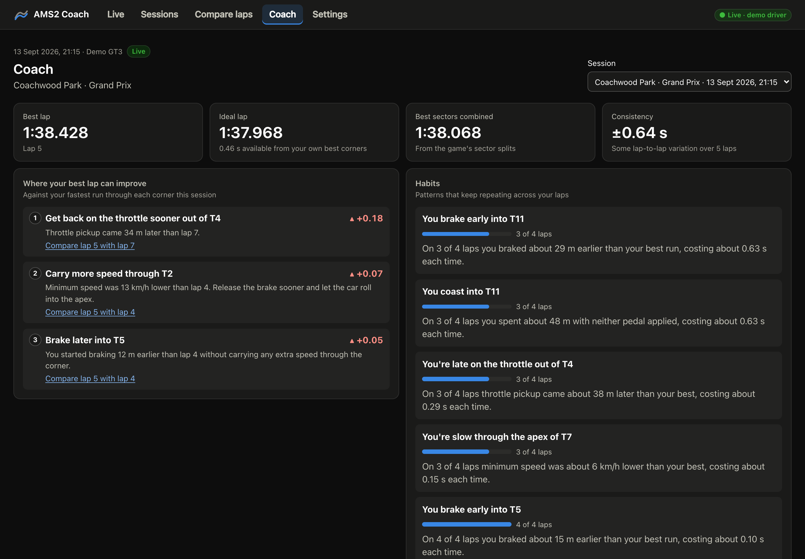

Every suggestion compares you with **yourself**: your best lap, or the lap where you took that
corner best. If you've done it once, you can do it again. Read
[how the coach works](docs/how-coaching-works.md).

### Live presets

The Live page is a grid of cards, three wide and two high, so a whole preset fits on one
screen. Every card comes in a **glance** size (one cell) and a **full** size (two cells wide):
the last corner with its speed, balance and throttle and brake strips, your line and steering
through it against your best run, a grip circle showing how much of the car's grip you used
through it, the next corner, corner-by-corner time, live balance, grip events, delta, lap trend
and car status. Start from the Focus, Optimisation and Full presets,
then choose **Edit layout** to add, resize or swap cards and save your own. Press
<kbd>1</kbd>–<kbd>9</kbd> to switch between them. The **Card lab** page shows every card in
both sizes.

### Tune the car

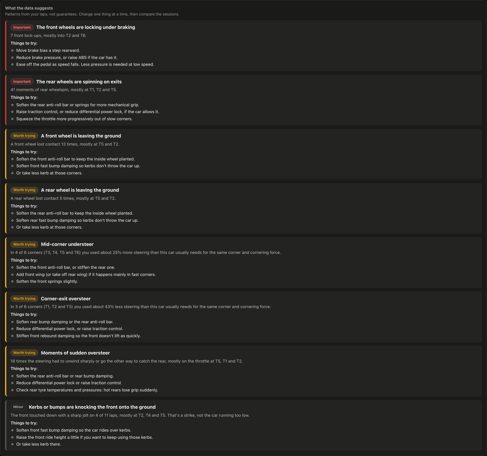

The setup page turns suspension, wheel-speed and yaw data into plain findings, each with the
evidence and a short list of things to try. Every figure is explained in
[docs/car-setup.md](docs/car-setup.md).

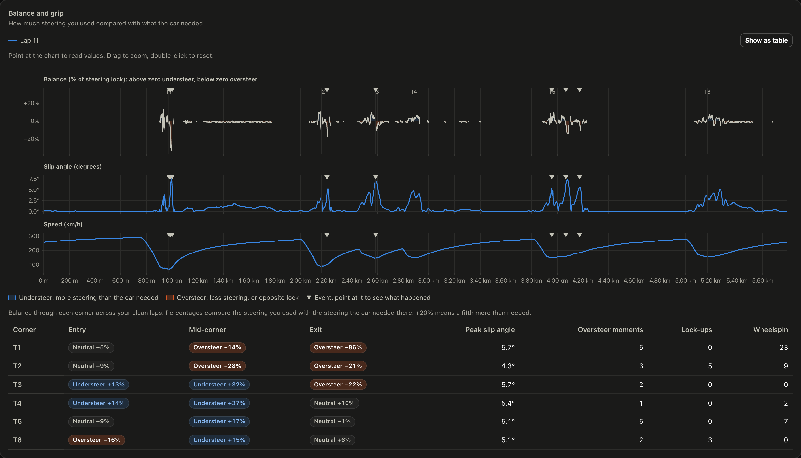

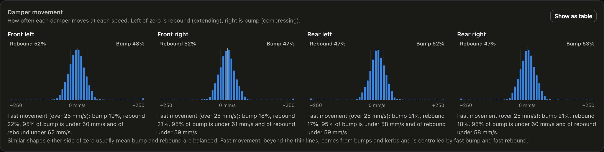

### Every lap, saved

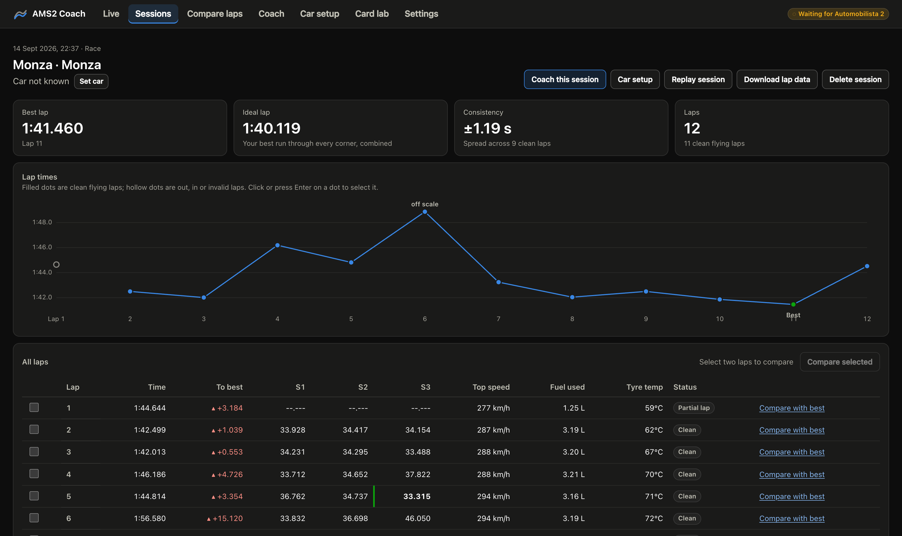

### Light theme and phone layout

<table>
  <tr>
    <td width="72%">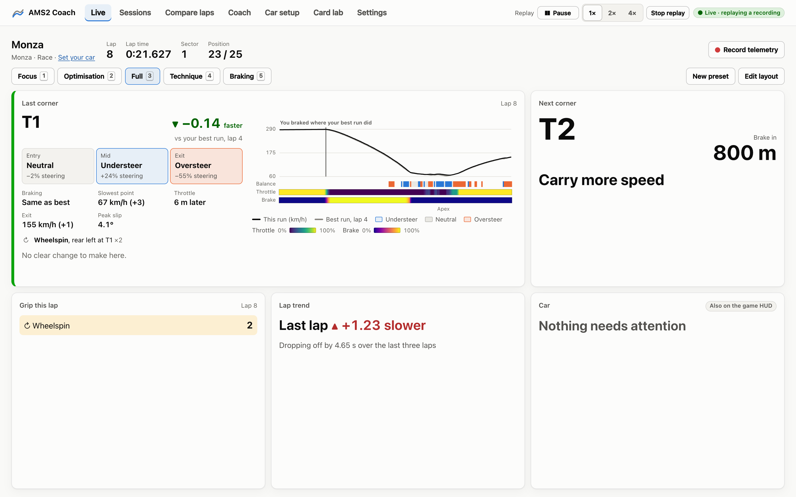</td>
    <td width="28%">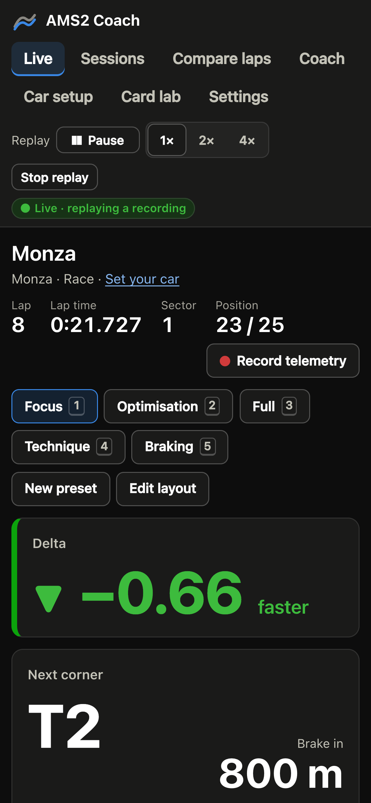</td>
  </tr>
</table>

To view the dashboard on a tablet or laptop, start it with `npm start -- --host 0.0.0.0` and open
the network address it prints.

## How it works

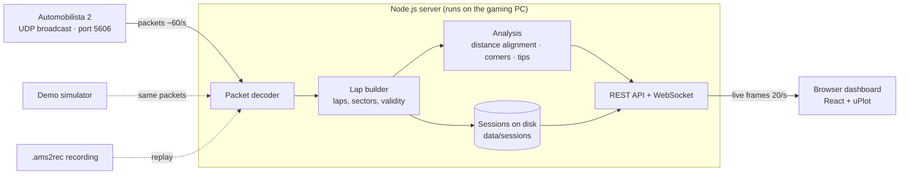

1. **Decode.** AMS2 broadcasts the Project CARS 2 UDP protocol. Every packet layout is declared
   once and used both to decode the game's packets and to encode the simulator's
   ([protocol notes](docs/protocol.md)).
2. **Build laps.** Telemetry and timing packets are merged into ticks and cut into laps using
   the game's lap counter, official lap times, sector splits and its invalid-lap flag.
3. **Line laps up by distance.** Each lap is resampled every 2 m, so the same point on track
   lines up in every lap. That gives the live delta, the predicted lap and lap-to-lap traces.
4. **Find the corners and coach.** Corners are detected from speed on your best lap. Braking
   point, minimum speed, throttle pickup, exit speed and coasting are measured for every corner
   on every lap, then turned into ranked, specific advice.

### Why this stack

| Choice | Why |
|---|---|
| **Browser dashboard** | Runs on any screen: second monitor, tablet or laptop. Nothing to install per device. |
| **Node.js server, TypeScript end to end** | One language for the protocol, analysis and UI. Node runs the TypeScript directly (no server build step), and the analysis code is shared with the browser. |
| **UDP, not shared memory** | Works across operating systems and machines, needs no native Windows modules, and recordings replay identically on a Mac. |
| **uPlot** | Draws tens of thousands of points per chart quickly, which live telemetry needs. |
| **Files on disk** | Sessions are plain JSON and gzip in `data/`. No database to install. |

## Recording and sharing raw telemetry

Press **Record telemetry** on the Live or Sessions page before you head out, and press it again
when you're done. Or tick **Record every session automatically** to get one file per session.
Recordings appear on the Sessions page with a **Download** button.

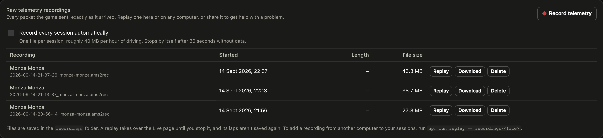

A recording holds every packet exactly as the game sent it, so it replays identically anywhere,
including on a Mac with no game installed:

```bash
npm run replay -- recordings/2026-09-13-19-55-01_interlagos-gp.ams2rec
```

Add `--speed 4` to fast-forward or `--loop` to repeat. Recordings are the best way to report a
bug or check the analysis against a particular car. Each session page also has **Download lap
data**, which gives the processed laps as JSON.

## Options

`npm start -- [options]` (the `--` passes options through npm):

| Option | Default | |
|---|---|---|
| `--source udp\|demo\|replay` | `udp` | where telemetry comes from |
| `--port` | `8606` | dashboard port |
| `--host` | `127.0.0.1` | use `0.0.0.0` to allow other devices on your network |
| `--udp-port` | `5606` | port AMS2 sends to |
| `--record` | off | start recording raw packets straight away |
| `--recordings <dir>` | `./recordings` | where recordings are saved |
| `--file`, `--speed`, `--loop` | | replay controls |
| `--prefill <laps>` | `0` | demo: simulate laps instantly before going live |
| `--data <dir>` | `./data` | where sessions are stored |
| `--open` | off | open the dashboard in your browser |

Other tools such as SimHub or CrewChief can listen to the game at the same time.

## Accessibility

- Colours come from a palette validated for protanopia and deuteranopia, and all text meets
  WCAG AA contrast in both themes.
- Meaning never relies on colour alone: time differences have a sign, an arrow and words; lap
  status and tyre warnings are labelled.
- Every chart has a legend and a **Show as table** view.
- Full keyboard support with visible focus, a skip link, and landmarks.
- Screen readers get one polite announcement per completed lap, never per frame.
- Respects reduced motion, high contrast and forced colours, and scales to 150% text.

## Status and roadmap

The protocol decoder follows the published Project CARS 2 UDP definitions (which AMS2 uses) and
is tested end to end with a byte-accurate simulator. A few fields are
[not yet verified against every AMS2 build](docs/protocol.md#units-and-known-unknowns). If
something looks off, please open an issue with a recording.

- [ ] Verify every field against live AMS2 sessions
- [ ] Real corner names for known circuits
- [ ] Verify the chassis channels (units and directions) against more cars
- [ ] Tyre temperature across the tread (inside, middle, outside) for camber and pressure
- [ ] Friction-circle (g-g) chart
- [ ] Import and export laps to compare with friends
- [ ] Optional shared-memory source on Windows for extra channels
- [ ] Packaged Windows app (no Node.js install)

## Contributing

Issues, recordings and pull requests are welcome. See [CONTRIBUTING.md](CONTRIBUTING.md) for
setup (any OS, no game needed), the project layout and the accessibility checklist.

## Credits

- Packet definitions: `SMS_UDP_Definitions.hpp` by Slightly Mad Studios.
- Bit-field decoding cross-checked against [CrewChief V4](https://github.com/mrbelowski/CrewChiefV4).
- Charts by [uPlot](https://github.com/leeoniya/uPlot).

Not affiliated with or endorsed by Reiza Studios. Automobilista 2 is a trademark of its
respective owner.

## License

[MIT](LICENSE)
