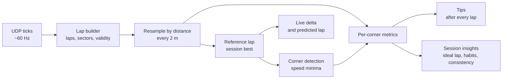

# How the coach works

The coach never compares you with a theoretical perfect lap or someone else's
data. Every suggestion points at something **you have already done** in this
session: your best lap, or your best run through that particular corner. If you
did it once, you can do it again.

## 1. Laps

Ticks from the game are cut into laps using the game's lap counter. Each lap
records time, distance, speed, pedals, steering, gear, RPM, position and how many
wheels are off the track. The official lap time comes from the game's time-stats
packet; sector splits are taken where the sector changes.

A lap is **coachable** when it's a complete flying lap (not an out lap, in lap or
partial lap) and the game didn't invalidate it.

## 2. Line laps up by distance

Two laps can't be compared by time (you reach turn 3 at different moments), so
every lap is resampled onto a fixed grid: one point every 2 metres. Point 1,200 is
the same place on track in every lap, so subtracting the time at each point gives
the **delta trace**: how far ahead or behind you were, all the way round.

The **live delta** is the same idea in real time: your current lap time minus the
reference lap's time at your current distance. **Predicted lap** = reference lap
time + live delta.

## 3. Find the corners

Corners are found on your session-best lap as significant local minima in speed:
the car must slow by at least ~9 km/h to count. Flat-out kinks are ignored, since
there's nothing to coach there. Dips that never recover in between are merged into
one corner.

Each corner owns a **segment** that starts ~30 m before its braking point and runs to
the next corner's segment. Segments tile the whole lap, so the time lost in every
corner adds up exactly to the lap-time difference.

## 4. Measure each corner

For every lap and every corner:

| Metric | Meaning |
|---|---|
| Segment time | seconds from segment start to end |
| Brake point | first point where brake > 10% |
| Minimum speed | slowest point within 60 m of the apex |
| Throttle point | first point after the slowest point with throttle > 25% and brake off |
| Exit speed | speed up to 120 m after the apex |
| Coasting | metres with neither pedal applied between braking and throttle |
| Off track | two or more wheels on grass, gravel, sand or similar |

## 5. Turn differences into advice

When a corner costs more than **0.03 s** against the reference run, the differences
are checked in order:

| Tip | Triggered when |
|---|---|
| Brake later | braked ≥ 8 m earlier without carrying more minimum speed |
| Brake a touch earlier | braked ≥ 8 m later **and** minimum speed dropped ≥ 3 km/h |
| Don't over-drive | faster at the apex but ≥ 3 km/h slower on exit |
| Carry more speed | minimum speed ≥ 3 km/h lower |
| Back on the throttle sooner | throttle pickup ≥ 10 m later |
| Improve your exit | exit speed ≥ 3 km/h lower (when nothing above explains it) |
| Stop coasting | ≥ 15 m more coasting than the reference |
| Stay on the track | wheels off where the reference stayed on |

Thresholds live in [`src/shared/analysis/coach.ts`](../src/shared/analysis/coach.ts).

## 6. Session insights

- **Ideal lap**: your best lap minus everything it lost against your best run through
  each corner. It's the lap you've already driven, in pieces.
- **Where your best lap can improve**: the tips from that comparison, biggest first,
  each with a link to compare against the lap that did it better.
- **Habits**: a tip that shows up on at least 40% of your laps (and at least twice)
  at the same corner. Fixing a habit is worth more than fixing a one-off.
- **Consistency**: the standard deviation of clean lap times within 107% of your best.

## Limitations

- Corners are numbered in the order they're detected (T1, T2, …), which may not match
  the circuit's official names.
- Coaching is relative to you. It finds inconsistency and missed opportunities; it
  can't tell you that everyone else brakes 30 m later.
- Car setup, fuel load and tyre wear change what's possible between laps.
