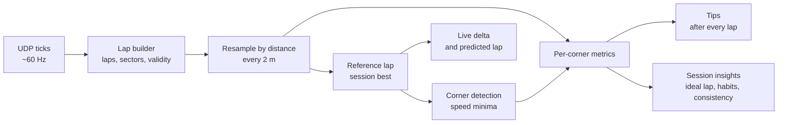

# How the coach works

The coach never compares you with a theoretical perfect lap or someone else's
data. Every suggestion points at something **you have already done** in this
session: your best lap, or your best run through that particular corner. If you
did it once, you can do it again.

## 1. Laps

Ticks from the game are cut into laps using the game's lap counter. Each lap
records time, distance, speed, pedals, steering, gear, RPM, position and how many
wheels are off the track. The official lap time comes from the game's time-stats
packet; sector splits are taken where the sector changes.

A lap is **coachable** when it's a complete flying lap (not an out lap, in lap or
partial lap) and the game didn't invalidate it.

## 2. Line laps up by distance

Two laps can't be compared by time (you reach turn 3 at different moments), so
every lap is resampled onto a fixed grid: one point every 2 metres. Point 1,200 is
the same place on track in every lap, so subtracting the time at each point gives
the **delta trace**: how far ahead or behind you were, all the way round.

The **live delta** is the same idea in real time: your current lap time minus the
reference lap's time at your current distance. **Predicted lap** = reference lap
time + live delta.

## 3. Find the corners

Corners are found on your session-best lap as significant local minima in speed:
the car must slow by at least ~9 km/h to count. Flat-out kinks are ignored, since
there's nothing to coach there. Dips that never recover in between are merged into
one corner.

Each corner owns a **segment** that starts ~30 m before its braking point and runs to
the next corner's segment. Segments tile the whole lap, so the time lost in every
corner adds up exactly to the lap-time difference.

## 4. Measure each corner

For every lap and every corner:

| Metric | Meaning |
|---|---|
| Segment time | seconds from segment start to end |
| Brake point | first point where brake > 10% |
| Minimum speed | slowest point within 60 m of the apex |
| Throttle point | first point after the slowest point with throttle > 25% and brake off |
| Exit speed | speed up to 120 m after the apex |
| Coasting | metres with neither pedal applied between braking and throttle |
| Off track | two or more wheels on grass, gravel, sand or similar |

## 5. Turn differences into advice

When a corner costs more than **0.03 s** against the reference run, the differences
are checked in order:

| Tip | Triggered when |
|---|---|
| Brake later | braked ≥ 8 m earlier without carrying more minimum speed |
| Brake a touch earlier | braked ≥ 8 m later **and** minimum speed dropped ≥ 3 km/h |
| Don't over-drive | faster at the apex but ≥ 3 km/h slower on exit |
| Carry more speed | minimum speed ≥ 3 km/h lower |
| Back on the throttle sooner | throttle pickup ≥ 10 m later |
| Improve your exit | exit speed ≥ 3 km/h lower (when nothing above explains it) |
| Stop coasting | ≥ 15 m more coasting than the reference |
| Stay on the track | wheels off where the reference stayed on |

Thresholds live in [`src/shared/analysis/coach.ts`](../src/shared/analysis/coach.ts).

## 6. Session insights

- **Ideal lap**: your best lap minus everything it lost against your best run through
  each corner. It's the lap you've already driven, in pieces.
- **Where your best lap can improve**: the tips from that comparison, biggest first,
  each with a link to compare against the lap that did it better.
- **Habits**: a tip that shows up on at least 40% of your laps (and at least twice)
  at the same corner. Fixing a habit is worth more than fixing a one-off.
- **Consistency**: the standard deviation of clean lap times within 107% of your best.

Contact and spins are left out of habits, each corner's typical time and consistency:
a run through a corner where you were hit or spun isn't a habit, and one spin would swamp
an average. They're found the same way as on the Car setup page (sideways acceleration no
cornering or braking could produce, or the car more than 25° sideways), with a margin of
1 s before and 3 s after. Running wide isn't left out: that is a habit worth knowing about.

## 7. Grip used

Coaches plot a **g-g diagram** (the friction circle): cornering g across, braking and
accelerating g up and down. A driver using the whole tyre traces round the edge, braking
into the turn and feeding in throttle out of it; gaps inside the edge are grip left unused.
The **Last corner grip** card on the Live page draws one for every corner you drive, and the
**Grip used** card on the Car setup page does it for every corner across the whole session.

The edge isn't a tyre model. It's the most grip you've shown this session, learned from
your last six laps while driving, or from every lap on the Car setup page:

- g is averaged over ±0.1 s first, taking out kerb and bump noise.
- Laps are split into 36 km/h speed bands. In each band the limit for cornering, braking
  and accelerating is the g you reach or beat 2% of the time (at least 2 s of driving).
  Spins and contact are left out.
- Downforce only adds grip as speed rises, so cornering and braking grip seen at one speed
  is carried up to every faster band. A flat-out kink never asks for full grip, so it
  can't lower the limit.
- Between those directions, braking and turning at once is limited by the ellipse through
  them, the usual tyre friction ellipse. Accelerating is limited by what the engine gave
  at that speed.

Everything on the card is a share of that limit at that moment's speed and direction, so
100% is always the edge of the circle. Three things don't count towards grip used:

| Not counted | Why |
|---|---|
| Flat out | the engine is the limit, not the tyres |
| Changing direction | turning hard one way to hard the other within 1.5 s: grip has to pass through zero |
| Contact or a spin | it says nothing about how you drive |

The rest is split by what your feet were doing (braking, off the pedals, part throttle),
weighted by time. **Most grip left** is the stretch below 85% that left the most grip
unused (time × grip left), at least 0.4 s long. It's measured on your best run through the
corner too, for comparison.

On the Car setup page each corner shows the median over your clean laps, and **where grip
is usually left**: the phase that most laps' biggest gap fell in, at its typical distance
from the apex. The table of grip at each speed is what 100% means on the circle; where you
never braked hard at a speed, braking grip is taken to match cornering grip.

The analysis lives in [`src/shared/analysis/grip.ts`](../src/shared/analysis/grip.ts).

## 8. Brake and throttle technique

The **Brake and throttle** card looks at how the pedals were used through each corner,
against your best run through it, using the throttle pedal itself rather than the game's
throttle (which includes its own blips on downshifts):

| Measure | Meaning |
|---|---|
| To peak pressure | seconds from touching the brake to 90% of that stop's peak |
| Release | seconds from dropping below 90% of the peak to fully off (under 5%) |
| Trail | seconds still braking after turn-in; turn-in is where steering reaches 40% of the most used before the apex |
| Pickup to flat out | seconds from 25% throttle, after the brake is off, to 95% |
| Backed off | times the throttle dropped 15% or more before reaching flat out |
| While adding lock | seconds adding throttle while the steering was still increasing |

It also shows the share of the last lap spent flat out against your best lap, and picks
out the one difference from your best run most worth knowing about. The analysis lives
in [`src/shared/analysis/pedals.ts`](../src/shared/analysis/pedals.ts).

## 9. Trail braking: string theory

Coaches describe trail braking with a string tied from the steering wheel to the brake
pedal: as you turn in, the string pulls the brake off, so the tyres are never asked to
brake hard and turn hard at the same time. A second string ties the wheel to the
throttle on the way out: as the lock comes off, the throttle goes down.

The **Trail braking** card plots it for every corner, against your best run through it:

- **In:** brake against steering, from the first touch of the brake to the most lock in
  the corner. Steering is a share of that most lock. Following the string traces the
  diagonal from full brake with no lock to no brake at full lock. Straight-line braking
  runs down the left edge first, which is fine.
- **Out:** throttle against steering, from the most lock until flat out with the wheel
  straight. Following the string traces the diagonal from no throttle at full lock to
  full throttle with no lock.

| Measure | Meaning |
|---|---|
| Brake fully off | share of the lock on when the brake came off (under 5%); 0 means before turning in |
| Most brake with half the lock on | too much here asks the front tyres for braking and turning at once |
| Flat out | share of the lock still on when the throttle reached 95% |
| Most throttle at 80%+ lock | throttle fed in before the wheel starts to unwind |

Steering is smoothed over about 10 m, so a quick correction isn't read as the corner's
lock. The analysis lives in
[`src/shared/analysis/string-theory.ts`](../src/shared/analysis/string-theory.ts).

## Limitations

- Corners are numbered in the order they're detected (T1, T2, …), which may not match
  the circuit's official names.
- Coaching is relative to you. It finds inconsistency and missed opportunities; it
  can't tell you that everyone else brakes 30 m later.
- Car setup, fuel load and tyre wear change what's possible between laps.
- Grip used is measured against your own best, so it can't show grip you've never used
  anywhere at that speed. Early in a session the limit is still low, and runs can read
  over 100%.
